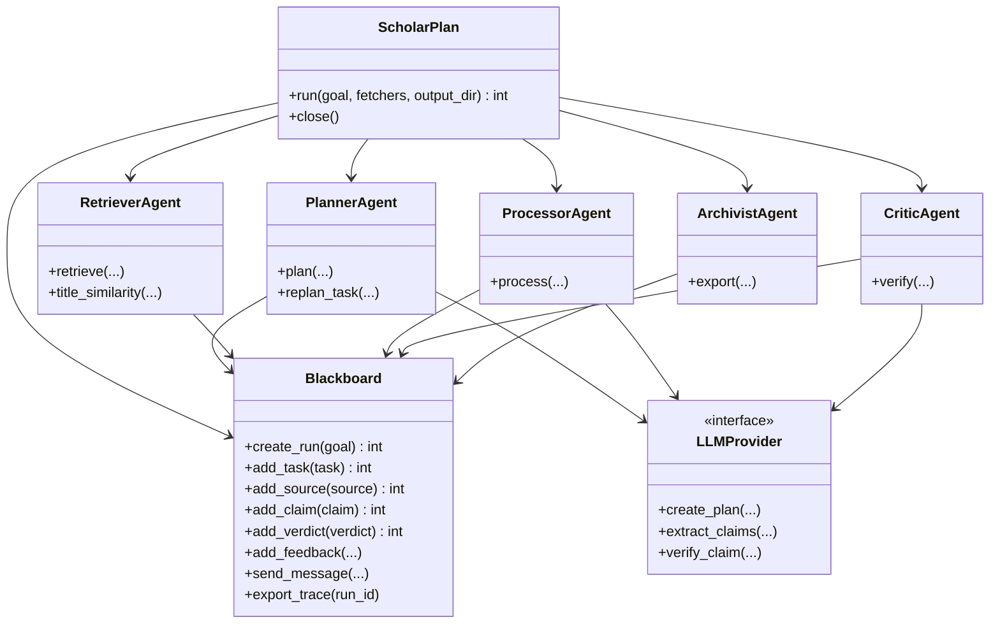

# ScholarPlan UML Class Diagram

```mermaid
classDiagram
    class ScholarPlan {
      +run(goal, fetchers, output_dir) int
      +close()
    }
    class Blackboard {
      +create_run(goal) int
      +add_task(task) int
      +add_source(source) int
      +add_claim(claim) int
      +add_verdict(verdict) int
      +add_feedback(...)
      +send_message(...)
      +export_trace(run_id)
    }
    class PlannerAgent {
      +plan(...)
      +replan_task(...)
    }
    class RetrieverAgent {
      +retrieve(...)
      +title_similarity(...)
    }
    class ProcessorAgent {
      +process(...)
    }
    class CriticAgent {
      +verify(...)
    }
    class ArchivistAgent {
      +export(...)
    }
    class LLMProvider {
      <<interface>>
      +create_plan(...)
      +extract_claims(...)
      +verify_claim(...)
    }

    ScholarPlan --> Blackboard
    ScholarPlan --> PlannerAgent
    ScholarPlan --> RetrieverAgent
    ScholarPlan --> ProcessorAgent
    ScholarPlan --> CriticAgent
    ScholarPlan --> ArchivistAgent
    PlannerAgent --> Blackboard
    RetrieverAgent --> Blackboard
    ProcessorAgent --> Blackboard
    CriticAgent --> Blackboard
    ArchivistAgent --> Blackboard
    PlannerAgent --> LLMProvider
    ProcessorAgent --> LLMProvider
    CriticAgent --> LLMProvider
```

This static structural view directly addresses the Unit 6 feedback that the
proposal contained behavioural and sequence diagrams but lacked a class diagram.
